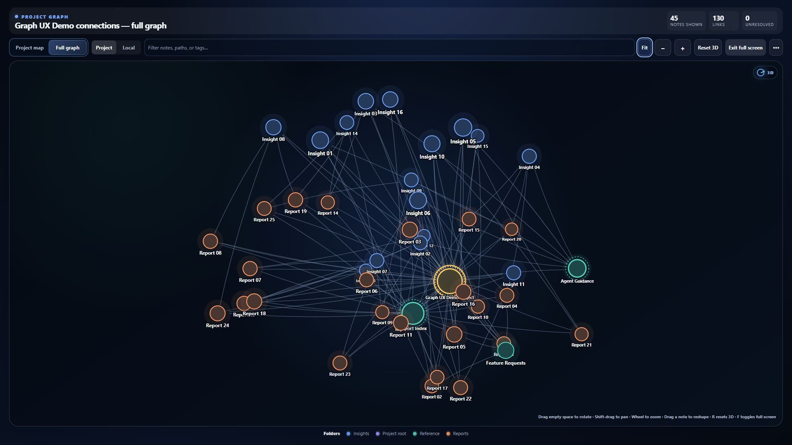

<p align="center">
  
</p>

<h1 align="center">Safire</h1>

<p align="center">
  A privacy-focused, local-first Markdown knowledge forge for Windows, macOS, and Linux.
</p>

<p align="center">
  <a href="https://github.com/kcmrshll9-ux/Safire/actions/workflows/ci.yml"></a>
  
  
  <a href="LICENSE"></a>
</p>

Safire keeps notes as ordinary Markdown files in a vault you choose. It adds a focused desktop workspace for writing, linking, research capture, graph exploration, tasks, attachments, and recovery without requiring a cloud account.

<p align="center">
  
</p>

<p align="center"><sub>Global graph view using an invented demonstration vault.</sub></p>

## Project status

| Item | Current state |
| --- | --- |
| Current version | 1.5.0 |
| Current source | Safire 1.5.0 release source; see the changelog below |
| Desktop targets | Windows x64, macOS Apple Silicon and Intel, Linux x64 |
| Storage | Local Markdown vault selected by the user |
| Official downloads | [GitHub Releases](https://github.com/kcmrshll9-ux/Safire/releases) |
| License | [MIT](LICENSE) |

Safire is under active development. Version 1.5.0 adds native macOS and Linux packages while retaining the MIT license and security hardening from the 1.4 series. See the [changelog](CHANGELOG.md#150---2026-08-16) for details. Back up important vaults independently and review the [security policy](SECURITY.md) before using Safire with sensitive material.

## Highlights

- Local filesystem-backed Markdown vault with nested notes and folders
- Split editor and preview, focused edit and reading modes, and tabbed notes
- Search, tags, backlinks, outgoing links, and `[[wiki links]]`
- Interactive 2D force-directed graph with global and local scopes and explicit large-vault rendering limits
- Large graph responses are limited to 1,000 notes, 2,000 links, and 2 MiB of response data; link targets and aliases are limited to 1,024 characters and 2 KiB, at most 250 unique unresolved placeholders are rendered, the active note is retained, and truncation or omitted imported content is visibly labeled
- Graph depth, filters, folder/tag grouping, display controls, and adjustable forces
- Node hover, drag, pan, zoom, keyboard navigation, context actions, and in-graph note panels
- Daily notes, Markdown tasks, templates, quick capture, and saved searches
- Command palette, quick switcher, and Markdown formatting controls
- Drag-and-drop, paste, and file attachments
- Cross-process serialized note mutations with complete backup-before-write publication, exact versioned path metadata, preview, and contained restore tools
- Web Clipper and private evidence receipts for local research workflows
- Vault health summaries and configurable local-first settings
- Legacy vault-scoped MCP server with a deliberately narrow eight-tool surface
- Optional, additive six-tool MCP sidecar for attributed general-agent memory

## Privacy model

Safire is local-first, but “local-first” does not mean the application never uses the network.

- Notes, settings, attachments, and backups are stored in the selected local vault.
- The local HTTP API binds to `127.0.0.1` by default.
- File APIs reject paths outside the selected vault.
- Safire has no built-in cloud synchronization or account service.
- Opt-in agent memory is stored as plaintext JSON beneath the selected vault; opaque filenames do not encrypt it.
- The memory sidecar records only explicit tool or host calls. It does not monitor transcripts or auto-capture agent activity.
- The Web Clipper makes an outbound request only when the user asks it to capture a public URL.
- Recognized YouTube links use a local-only card and contact YouTube only after the user opens the link.
- Imported note bodies larger than 1 MiB are checked by metadata only and omitted from generic metadata, search, MCP list/search, and graph indexing; explicit note reads remain available. A single index operation reads at most 16 MiB of note bodies.
- Generic note, tree, template, search, task, backlink, backup-list, vault-health, graph, and matching eight-tool MCP index responses retain at most 1,000 notes or backup entries and 2 MiB of serialized output. Task lists retain at most 2,000 tasks; tags, links, evidence receipts, paths, fields, traversed directories, directory entries, and nesting depth have additional fixed per-note and per-operation ceilings. Generic backup metadata and filtered content verification share a 16 MiB operation-read budget; explicit backup preview and restore remain separate explicit reads. Truncated results include conservative completion metadata: observed counts are lower bounds once traversal stops, not exact vault totals.
- Generic metadata, search, graph, health, task, and MCP projections exclude ordinary fenced code. Valid `safire-evidence` blocks contribute only their allowlisted public fields; private, malformed, ambiguous, and unclosed evidence contributes nothing. Explicit note reads retain raw Markdown, while explicit evidence reads retain private evidence fields by design.
- Safire reserves `.safire`, `.safire-backups`, and `.safire-note-mutations.lock` as internal vault path components. Note and folder mutations targeting those components are rejected before mutation-lock acquisition; on Windows, DOS short-name and alternate-stream spellings are conservatively rejected as aliases of internal paths.
- The desktop content policy blocks remote Markdown images; attach images to the local vault for Preview.
- Opening an external link hands that URL to the system browser.

The complete data-handling description is in [PRIVACY.md](PRIVACY.md).

Never use a personal vault in automated tests, public bug reports, screenshots, or logs. Use a disposable vault containing invented notes.

## Install

Use only downloads from the official [Safire GitHub Releases](https://github.com/kcmrshll9-ux/Safire/releases) page. Every release includes a SHA-256 checksum manifest. Windows and macOS builds are not code-signed by default, so Windows SmartScreen or macOS Gatekeeper may display a warning. Do not download applications claiming to be official Safire builds from third-party sites.

| Platform | Download |
| --- | --- |
| Windows x64 | Setup installer or portable executable |
| macOS Apple Silicon | `macos-arm64.dmg` |
| macOS Intel | `macos-x64.dmg` |
| Linux x64 | AppImage or Debian/Ubuntu `.deb` package |

An authorized local checkout can build packages on the matching operating system:

```powershell
npm ci
npm run check
npm run dist:installer
```

```sh
npm ci
npm run check
npm run dist:linux   # Linux
npm run dist:mac     # macOS
```

Windows output includes:

```text
release/Safire-Setup-1.5.0.exe
release/Safire-Portable-1.5.0.exe
```

The selected vault remains outside the application installation directory and is never packaged into an application update.

## Run from source

### Requirements

- Node.js 22.19 or later
- npm
- The target operating system for native Electron packaging and final desktop acceptance checks

Install the locked dependencies, verify the project, and build the application:

```powershell
npm ci
npm test
npm run typecheck
npm run build
```

Start the local server with an ignored, disposable vault:

```powershell
$env:SAFIRE_VAULT_PATH = (Join-Path $PWD ".qa-dev-vault")
npm start
```

Open `http://127.0.0.1:5277`. Use `npm run dev` for the Vite development server or `npm run desktop` for the Electron development application.

## Vault configuration

On first desktop launch, Safire asks the user to choose a vault folder. A typical location is:

```text
Documents/Safire Vault
```

Without `SAFIRE_VAULT_PATH`, the source server follows the saved desktop selection or uses `Documents/Safire Vault`. In the desktop app, use **Safire → Change Vault Location…** to switch later. The desktop application and MCP servers can share that saved selection.

## MCP integrations

Safire provides two separate, additive local stdio MCP servers. Neither server modifies Hermes or another agent host, and installing Safire does not add a transcript listener, background capture hook, or automatic memory collector.

The legacy vault server, `safire-mcp.mjs`, retains its exact eight-tool surface: `list_notes`, `read_note`, `create_note`, `update_note`, `quick_capture`, `list_tasks`, `toggle_task`, and `vault_health`. It works with Markdown notes through an in-process vault service, opens no HTTP listener, and does not expose delete, rename, attachment, backup-restore, or web-fetch tools.

Run the MCP server against a one-off test vault with:

```powershell
npm run mcp -- --vault "C:/path/to/Safire Test Vault"
```

A generic stdio configuration looks like:

```yaml
mcp_servers:
  safire:
    command: node
    args:
      - C:/path/to/Safire/safire-mcp.mjs
    timeout: 30
```

Restart the agent session after registering the server or changing the selected vault so its tool connection is refreshed.

The separate agent-memory server, `safire-memory-mcp.mjs`, exposes exactly six tools: `memory_record_events`, `memory_search`, `memory_get`, `memory_record_feedback`, `memory_recall`, and `memory_status`. It stores append-only, attributed event-backed memory beneath `<vault>/.safire/memory/v1/` without changing Markdown notes or the legacy MCP surface.

Run it with an operator-controlled version-1 profile and an explicit vault:

```powershell
npm run mcp:memory -- --profile-config "C:/path/to/agent-memory-profile.json" --vault "C:/path/to/Safire Test Vault"
```

Installed desktop packages expose a platform-native optional memory launcher: `resources/safire-memory-mcp.cmd` on Windows and `resources/safire-memory-mcp.sh` on macOS or Linux. An MCP host can use that launcher with the same arguments without a separate Node.js/source installation. Connection is still manual and opt-in; see the agent-memory guide for exact configuration. Portable Windows and AppImage builds do not promise a stable external launcher path.

The fixed profile provides stable principal, agent-instance, ingest-adapter, source, actor, and namespace identities. Ordinary portable profiles cannot claim user activity. Authenticated user events require the separate trusted-bridge library seam and a host-supplied authenticator; that seam is not a listener or installed transport. Harry and Moltbook appear only in reference examples—Safire memory is agent-general, and Moltbook is modeled there only as automation delegated by the reference Harry profile.

Memory records are local plaintext JSON. Use operating-system permissions and device encryption where confidentiality matters, and never submit credentials, tokens, private reasoning, chain-of-thought, or scratchpad material in content, identifiers, metadata, or search queries. See the [agent-memory guide](docs/memory/README.md), [security model](docs/memory/SECURITY.md), and [trusted-bridge contract](docs/memory/TRUSTED_BRIDGE.md) before enabling it.

## Keyboard shortcuts

| Shortcut | Action |
| --- | --- |
| `Ctrl/Cmd+K` | Command palette |
| `Ctrl/Cmd+O` | Quick switcher |
| `Ctrl/Cmd+S` | Save active note |
| `Esc` | Close the active palette, switcher, or dialog |

## Documentation

See the [documentation index](docs/README.md) for the current documentation status and bundled legacy manuals. Some bundled HTML/PDF guides predate the current graph and evidence features; the application and this README are authoritative where they differ.

## Repository map

| Path | Responsibility |
| --- | --- |
| `src/` | React user interface and styles |
| `src/GraphView.tsx` | Interactive 2D relationship graph |
| `server.mjs` | Loopback HTTP API and vault operations |
| `electron/` | Cross-platform desktop application entry point |
| `safire-mcp.mjs` | Legacy eight-tool Markdown-vault MCP server |
| `safire-memory-mcp.mjs` | Separate six-tool general-agent memory MCP server |
| `lib/memory/` | Versioned local memory schemas, profiles, persistence, search, and trust seam |
| `test/` | Automated tests using disposable data |
| `docs/` | User and agent documentation |
| `press-kit/` | Brand and media materials |

## Support, security, and contributions

- Read [SUPPORT.md](SUPPORT.md) before opening a support request.
- Report suspected vulnerabilities through the private process in [SECURITY.md](SECURITY.md).
- Review [CONTRIBUTING.md](CONTRIBUTING.md) before proposing a change.
- Participation in project spaces is governed by the [Code of Conduct](CODE_OF_CONDUCT.md).
- Notable changes are recorded in [CHANGELOG.md](CHANGELOG.md).
- Third-party licenses and distribution obligations are summarized in [THIRD_PARTY_NOTICES.md](THIRD_PARTY_NOTICES.md).

## License and trademarks

Safire is open-source software licensed under the [MIT License](LICENSE). You may use, copy, modify, merge, publish, distribute, sublicense, and sell copies subject to the license's copyright-and-permission-notice requirement.

The MIT License does not grant permission to use the Safire name, flame mark, or other project branding in a way that suggests endorsement or affiliation. See [TRADEMARKS.md](TRADEMARKS.md).

Contributions are licensed under the same MIT terms. See [CONTRIBUTING.md](CONTRIBUTING.md) before proposing a change.
